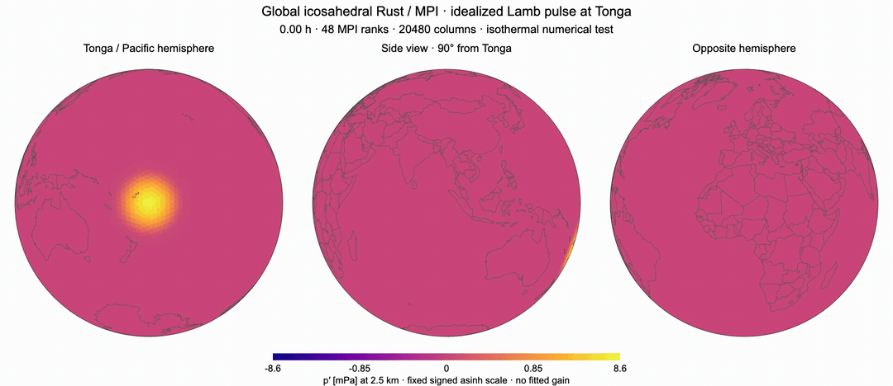
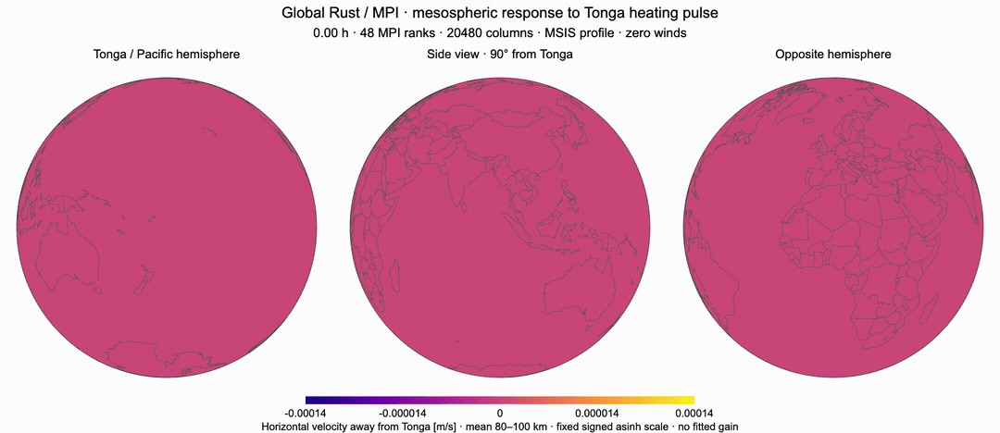
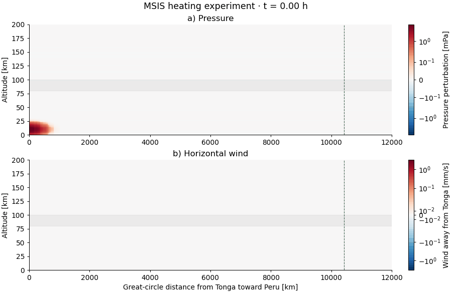

# RNS — Rust Navier–Stokes

Rust/MPI atmospheric solver on an icosahedral grid. Nonlinear compressible Euler core with MUSCL/HLLE and optional viscous transport.

Build (requires Rust, MPI and HDF5):

```sh
cargo build --release
cargo test --release
```

## Lamb wave




```sh
mpirun -np 48 target/release/global-neutral-euler --level 5 --layers 12 --dz 5000 --end 60000 --cadence 600 --sigma-km 500 --case lamb --sponge --output output/tonga_lamb
```

## Tonga L1/L2 experiment





```sh
mpirun -np 48 target/release/global-neutral-euler --level 5 --layers 80 --dz 2500 --end 60000 --cadence 1200 --sigma-km 250 --case heat --background data/tonga_msis_200km.h5 --sponge --output output/tonga_msis
```

MSIS heating profile, 0–200 km altitude. [Poblet et al. (2023)](https://doi.org/10.1029/2023GL103809).

Extract and render both new runs (Python: NumPy, SciPy, h5py, Matplotlib, Pillow; FFmpeg for MP4):

```sh
conda run -n base python scripts/export_tonga_peru_section.py --lamb output/tonga_lamb --mesosphere output/tonga_msis --output data/tonga_peru_sections.h5
conda run -n base python scripts/render_tonga_peru_section.py data/tonga_peru_sections.h5 --output examples/tonga
```

Globe animations:

```sh
conda run -n base python scripts/render_globe.py output/tonga_lamb --output examples/tonga/lamb
conda run -n base python scripts/render_globe.py output/tonga_msis --field mesowind --output examples/tonga/msis
```
